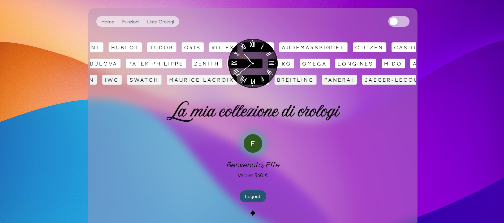
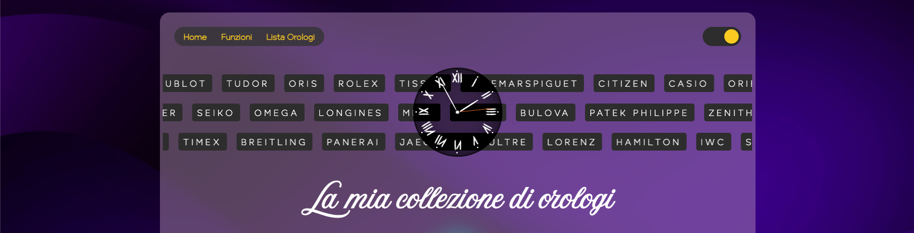
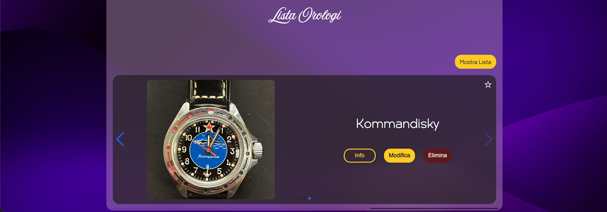

# ⌚ ChroneApp - La tua collezione di orologi digitale

ChroneApp è un'applicazione web moderna e responsiva progettata per gli appassionati di orologi che desiderano catalogare, gestire e interagire con la propria collezione personale in modo intuitivo e veloce.

---

## Indice
- [🚀 Funzionalità Principali](#-funzionalità-principali)
- [Funzioni Intelligenti e Interattive](#funzioni-intelligenti-e-interattive)
- [Interfaccia Utente e Performance](#interfaccia-utente-e-performance)
- [🛠️ Stack Tecnologico](#️-stack-tecnologico)
- [Screenshots](#screenshots)
- [Contributing](#contributing)
- [Contributors](#contributors)
- [Licenza](#licenza)
- [Contatti](#contatti)
- [Ringraziamenti](#ringraziamenti)

---

## 🚀 Funzionalità Principali
- Gestione e Visualizzazione della Collezione
- Registrazione e Accesso Utente: Autenticazione sicura tramite Supabase.
- Gestione Orologi: Inserimento, modifica ed eliminazione degli orologi dalla collezione.
- Vista Dinamica: Alternanza tra la visualizzazione a Griglia, con la possibilità di selezionare gli orologi preferiti, e la visualizzazione a Carosello.
- Organizzazione Avanzata: Ordinamento automatico per Orologi Preferiti e per nome.

## Funzioni Intelligenti e Interattive
- Valore Totale: Calcolo in tempo reale del valore complessivo della collezione.
- Orologio del Giorno: Selezione casuale di un orologio dalla collezione per suggerire cosa indossare.
- Completa l'Outfit (Color Matching): Analisi del colore predominante di un'immagine caricata dall'utente (es. un outfit) e suggerimento degli orologi in collezione con il colore più simile.

## Interfaccia Utente e Performance
- Modalità Scuro/Chiaro: Toggle dinamico della Dark Mode.
- Effetti Visivi: Effetto "frosted glass" sulla barra di navigazione.
- Orologio Analogico Funzionante: Un orologio analogico in CSS e JavaScript puro che mostra l'ora attuale.
- Brand Scroller: Liste di marchi in scorrimento continuo per un tocco estetico.

## 🛠️ Stack Tecnologico

| Categoria | Tecnologia | Note |
| :--- | :--- | :--- |
| **Frontend** | **React** (Hooks, `useMemo`, `useTransition`) | Sviluppo dell'interfaccia utente. |
| **Styling/Animazioni** | **Framer Motion** | Per animazioni fluide del layout (effetto FLIP nel cambio di ordine dei preferiti). |
| **Carosello** | **Swiper.js (via React)** | Componente leader per caroselli e slider. |
| **Backend/DB** | **Supabase** | Backend-as-a-Service (Auth, Database PostgreSQL, Storage). |
| **Storage** | **Supabase Storage** | Gestione dello storage delle immagini. |

## Screenshots

(aggiungi qui immagini o GIF del progetto per mostrare UI, carosello, modalità scura, ecc.)

<!--*(Sostituisci i percorsi con le immagini effettive nella cartella docs/screenshots)*--->

## Contributing

Grazie per voler contribuire! Puoi contribuire tramite:
- Segnalazioni di bug (issue)
- Proposte di funzionalità (issue)
- Pull request con fix o miglioramenti

Linee guida rapide:
1. Fork del repository.
2. Crea un branch feature/bugfix: git checkout -b feature/nome-feature
3. Fai i tuoi cambiamenti e committa: git commit -m "Descrizione"
4. Apri una pull request verso il branch principale del repo originale.

## Roadmap

- [ ] Selettore delle varie complicazioni
- [ ] Note aggiuntive per ogni orologio
- [ ] Condizione dell'orologio (Scala 1-10)
- [ ] Stato Set: Completo (scatola e garanzia), Solo orologio, ecc.
- [ ] Storico Manutenzioni: Campi per registrare date e costi delle revisioni.
- [ ] Garanzia (con immagini anche)
- [ ] Filtri di ricerca avanzati per marca, prezzo, anno

## Contributors

<!-- ALL-CONTRIBUTORS-LIST:START - Do not remove or modify this section --> 
<!-- prettier-ignore-start -->
<!-- markdownlint-disable -->
| Name | Role |
| --- | --- |
| [effe1209](https://github.com/effe1209) | 👨‍💻 Mantainer, Code |
| [altroUtente](https://github.com/altroUtente) | 📝 Documentazione |
<!-- markdownlint-enable -->
<!-- prettier-ignore-end -->
<!-- ALL-CONTRIBUTORS-LIST:END -->

## Licenza

Aggiungi una licenza per chiarire i termini. Esempio: MIT

MIT License — vedi il file LICENSE.

## Contatti

- Maintainer: effe1209 — https://github.com/effe1209

## Ringraziamenti

- Supabase — per backend e storage
- Framer Motion — per le animazioni
- Swiper.js — per il carosello
